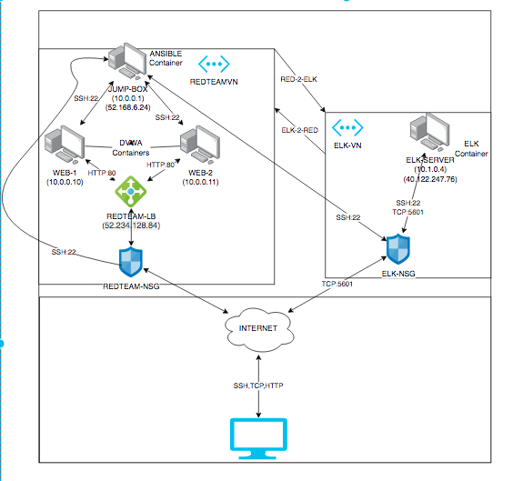
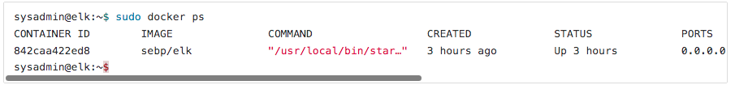

## Automated ELK Stack Deployment
$whoami;

Usama Asfoor

pwd

~/UCB/Cyberxsecurity/bootcamp/Week13/Project-1

#This demonstration will help you deploy an ELK stack on your own and hopefully learn how to eventually configure it to the way you want to.

#"ELK" is an ancronym for a trio of programs that work in sync to help analysts evaluate and visulize information. The "E" is for Elasticsearch, which is a search and analytics engine. The "L" is for Logstash, and it absorbs data from multiple sources simultaneously, organizes it and then sends it to a "stash". And lastly "K" for Kibana. Kibana is a great GUI tool that visualizes data for analysts with charts and graphs of the Elasticsearch. This creates the "ELK Stack" shown in my demonstration

#The VMs Used in this demonstration were deployed using Microsoft Azure, and are run on Ubuntu Linux, you may use a different deployment for VMs if pleased, however must run Ubuntu

#I.P Addresses of the virtual machines shown in this demonstration may vary, and must be adjusted to your new(or already existing) VMs

#The files in this repository were used to configure the network depicted below.

#These files have been tested and used to generate a live ELK deployment on Azure. They can be used to either recreate the entire deployment pictured above. Alternatively, select portions of the YAML file may be used to install only certain pieces of it, such as Filebeat.

  -[Ansible Config](Ansible/ansible.cfg)
  
  -[Ansible Hosts File](Ansible/Ansible-hosts.txt)
  
  -[ELK Playbook](YAML/elkplaybook.yml)
  
  -[FileBeat Config](YAML/filebeat-configuration.yml)
  
  -[FileBeat Playbook](YAML/filebeat-playbook.yml)
  
  -[MetricBeat Config](YAML/metricbeat-configuration.yml)
  
  -[MetricBeat Playbook](YAML/metricbeat-playbook.yml)

#This document contains the following details:
    - Description of the Topology
    - Access Policies
    - ELK Configuration
    - Beats in Use
    - Machines Being Monitored
    - How to Use the Ansible Build

### Description of the Topology

The main purpose of this network is to expose a load-balanced and monitored instance of DVWA, the D*mn Vulnerable Web Application.

Load balancing ensures that the application will be highly accessible , in addition to restricting outsiders to the network. They are desired because it protects the accessibility part of the CIA triad, ensuring there isnt an overload crash.

#RED-TEAM VN:

First, a Jump Box VM is placed to host containers for the other VMs, allowing access only from the public ip of the users public IP.(You can find yours on whatsmyip.org). Then after the Jump Box, will be two other VMs. The Jump Box Hosts Ansible, which is used to configure the docker containers that are running on the other two VMs. Load Balancer handles the traffic split between the two VMs. This setup is the way to go because it isolates the access between both sides of the files, reducing chances of attacks, and the load balancer helps any overload of data and prevents a chance of any DDOS.

he configuration details of each machine in the first virtual network (Red-Team) may be found below.
_Note: Use the [Markdown Table Generator](http://www.tablesgenerator.com/markdown_tables) to add/remove values from the table_.

| Name     | Function | IP Address | Operating System |
|----------|----------|------------|------------------|
| Jump Box | Gateway       | 10.0.0.1(private)/52.168.6.24(public)   | Linux            |
| WEB-1     | Docker Server   | 10.0.0.10           |   Linux               |
| WEB-2    |     Docker Server   |       10.0.0.11     |     Linux             |

#ELK-VN
In a seperate VN, we deploy a single VM, and call it ELK-Server. This is where our ELK will be deployed. Allow the ELK server to be accessed from the Jump Box through SSH.

The configuration details of each machine in the ELK Virtual Network may be found below.

| Name     | Function | IP Address | Operating System |
|----------|----------|------------|------------------|
| ELK-Server | ELK Gateway  | 10.1.0.4(private)/40.122.247.76(public)  | Linux            |

#Both VNs are peered together in and out

### Access Policies

The machines on the internal network are not exposed to the public Internet. 

Only the Jump Box machine can accept connections from the Internet. Access to this machine is only allowed from the following IP addresses:
<Local.Host.IP>

Machines within the network can only be accessed by The Jump Box.

Access to the ELK VM can be made through the Jump Box

A summary of the access policies in place can be found in the table below.

| Name     | Publicly Accessible | Allowed IP Addresses |
|----------|---------------------|----------------------|
| Jump Box    |       Yes             | <Local.Host.IP.>    |
|    WEB-1      |       No              |             10.0.0.1     |
|    WEB-2      |        No             |             10.0.0.1     |
|   ELK-SERVER |    No             |             10.0.0.1     |

### Elk Configuration

Ansible was used to automate configuration of the ELK machine. No configuration was performed manually, which is advantageous because it uses YAML playbooks, which is a great practice for configuration and  automation of your container deployment.

ELK YAML playbook could be downloaded below:

To set up the ELK server through the playbook:

First, SSH into the Jump-Box-Provisioner
check for the latest docker image you used ($docker container list -a)
if docker isnt up, run $docker start elk
Use the name of the docker image that is assigned at random. keep in mind to always log back in to the same name, as docker will recycle and creat a new name at random.
Start and Attach the ansible docker (sudo docker attach <docker-name>)
Add the ELK-Server ip address to the /ansible/hosts file.
Then head to /etc/ansible/roles directory and download the ELK "elkplaybook.yml"
Run the elkplaybook.yml in that same directory ($ansible-playbook elkplaybook.yml)
Then SSH into the ELK-SERVER VM to verify the server is up and running. ($sudo docker ps)
After "docker ps" you should get the following:

### Target Machines & Beats
This ELK server is configured to monitor the following machines:

WEB-1 (10.0.0.10)
WEB-2 (10.0.0.11)

Within the ELK Stack we will use FileBeat and MetricBeat.

Filebeat is used as a lightweight shipper for forwarding and centralizing log data. It works great collecting log files on remote servers.  Examples of filebeats findings can be files from a SQL database, or authentication history.
On the other hand, Metricbeat collects network metrics and statistics. It tells analysts if the statistics are looking normal and healthy. Examples of Metricbeat findings can be user count or memory usage

We have installed the following Beats on these machines

### Using the Playbook
In order to use the playbook, you will need to have an Ansible control node already configured. Assuming you have such a control node provisioned: 

SSH into the control node and follow the steps below:

-Edit ansible hosts file to include ELK server
- Copy the filebeat-config.yml file to /etc/ansible/
- Update the file to include ELK server ip address
- Copy the filebeat-playbook.yml file to /etc/ansible
- Copy the metricbeat-config.yml file to /etc/ansible/
- Update file to include ELK server ip address
- Run the playbook with ansible-playbook, and navigate to Kibana in your browser by entering http://[<ELK.Public.IP>]:5601/app/kibana to check that the installation worked as expected.
- After clicking DEB, Filebeat, and Metricbeat you shall see the following:

 

- The Playbook file is named "filebeat-playbook.yml and is stored in the /etc/ansible/"
- Make sure to update the filebeat-config.yml file to include the vms. The ELK server is running in a peer'ed VN with the VN with the ansible config files.

- Url to access the Kibana Database http://[<ELK.Public.IP>]:5601/app/kibana

_As a **Bonus**, provide the specific commands the user will need to run to download the playbook, update the files, etc._
After you download the playbook file from the repository, run the command "nano <file-to-edit>". This will let you edit the config and playbook files, which is required so that you can sync it within your own VMs.
After it is edited, you can run the command "ansible-playbook <playbookfile.yml>" this will automatically run the commands in the playbook, while configured to the settings in the related config.yml files.

